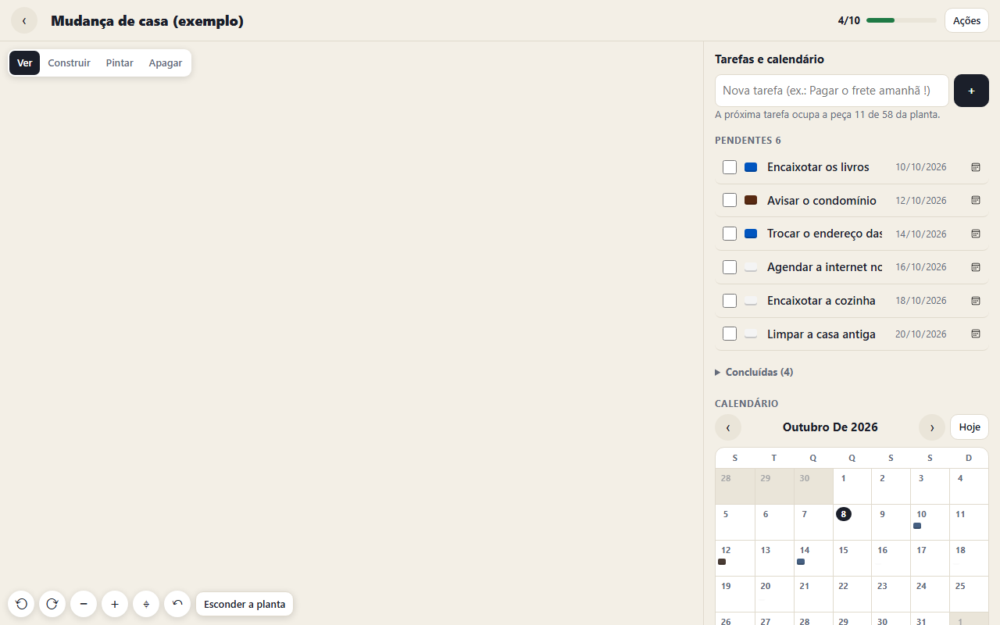

# Blocos 3

[](https://joaogabrielmontinirossi-sys.github.io/blocos3/)

Um simulador de montar em que **cada peça é uma tarefa**. Você escolhe um modelo (casa, foguete, castelo…), ele vira a planta da construção, e cada tarefa que você adiciona põe a próxima peça. A peça nasce clara; quando a tarefa é concluída, ela ganha cor. A construção fica pronta quando as tarefas acabam.

Faz parte da família [Blocos](https://github.com/joaogabrielmontinirossi-sys/blocos) (blocos de tempo) e [Blocos 2](https://github.com/joaogabrielmontinirossi-sys/blocos2) (tarefas, notas e quadros).

## Baixar (Windows)

Pegue o `Blocos3.exe` na página de [Releases](../../releases/latest) e abra. Não precisa instalar nada: o programa usa o Edge (ou o Chrome) que já está no Windows para mostrar a janela.

Como o arquivo não é assinado, o Windows pode mostrar o aviso do SmartScreen na primeira vez: clique em **Mais informações** e depois em **Executar assim mesmo**.

## No site e no celular

Abra **https://joaogabrielmontinirossi-sys.github.io/blocos3/** em qualquer navegador.

- **Android (Chrome)**: ⋮ › *Adicionar à tela inicial*.
- **iPhone/iPad (Safari)**: **Compartilhar** › **Adicionar à Tela de Início**.

Depois de aberta uma vez, a versão web funciona sem internet.

## Como funciona

| No app | É |
| --- | --- |
| **Construção** | Um projeto: um conjunto de peças numa base que não tem fim |
| **Modelo** | A planta da construção, desenhada em contorno até as peças chegarem |
| **Peça** | Um tijolo ou uma placa. Com nome, é uma tarefa |
| **Peça clara** | Tarefa pendente |
| **Peça colorida** | Tarefa concluída (ou peça solta, sem tarefa) |

- **Galeria**: cada construção aparece em miniatura, com o progresso. Tocar numa delas abre o palco com **todas as tarefas e o calendário** ao lado.
- **Tarefas**: escreva uma linha e ela ocupa a próxima peça da planta, de baixo para cima. `amanhã`, `hoje`, `25/12` definem o prazo e `!` a prioridade. Quando a planta acaba, as tarefas seguintes viram tijolos numa pilha ao lado.
- **Calendário**: cada tarefa com prazo é um quadradinho da cor da peça no dia certo. Tocar num dia mostra as tarefas dele.
- **Palco**: arraste para mover a base, role ou faça a pinça para aproximar, gire a vista em quatro direções. Tocar numa peça abre o cartão da tarefa; tocar numa tarefa mostra a peça.
- **Construir à mão**: dez formatos de peça, tijolo ou placa, quatorze cores. As peças empilham sozinhas onde você toca. Dar nome a uma peça solta faz dela uma tarefa.
- **Modelos**: casa, torre, pirâmide, castelo, ponte, foguete, árvore, farol, escada, carro, veleiro, muro, coração, estrela, troféu, cogumelo, robô e a base livre.

A lista completa está em [FUNCIONALIDADES.md](FUNCIONALIDADES.md).

## Sincronização

Funciona como nos outros aplicativos da família:

1. **Pasta do Google Drive para computador** (só no `.exe`): grava `blocos3-sync.json` em `Meu Drive\Blocos3` a cada alteração. Se o Google Drive para computador estiver instalado, já começa ligada; em **Ajustes** dá para desativar, trocar de conta ou escolher outra pasta.
2. **Conta Google** (`.exe`, site e celular): o mesmo arquivo fica na área privada do aplicativo no seu Google Drive. Usa o mesmo "ID do cliente OAuth" dos outros aplicativos; para o `.exe`, acrescente a origem `http://localhost:47895`.

Alterações feitas em dois aparelhos são mescladas por registro: vale a versão mais recente de cada construção e de cada peça, e as exclusões também são propagadas. A posição da câmera de cada construção fica só no aparelho.

## Compilar

Só precisa do Windows (usa o compilador C# do .NET Framework, que já vem instalado):

```powershell
powershell -ExecutionPolicy Bypass -File .\build.ps1
```

| Pasta | Conteúdo |
| --- | --- |
| `app/motor.js` | O desenho isométrico em canvas, sem bibliotecas |
| `app/modelos.js` | Os modelos de construção e a conversão de formas em peças |
| `app/app.js` | Galeria, palco, tarefas, calendário e eventos |
| `desktop/Blocos3.cs` | Programa de Windows: serve o app em `localhost` e grava a pasta de sincronização |
| `.github/workflows/` | Publica o site no GitHub Pages e o `.exe` em Releases a cada envio para a `main` |

## Licença

[MIT](LICENSE): pode usar, copiar, modificar e distribuir livremente, mantendo o aviso de autoria.
